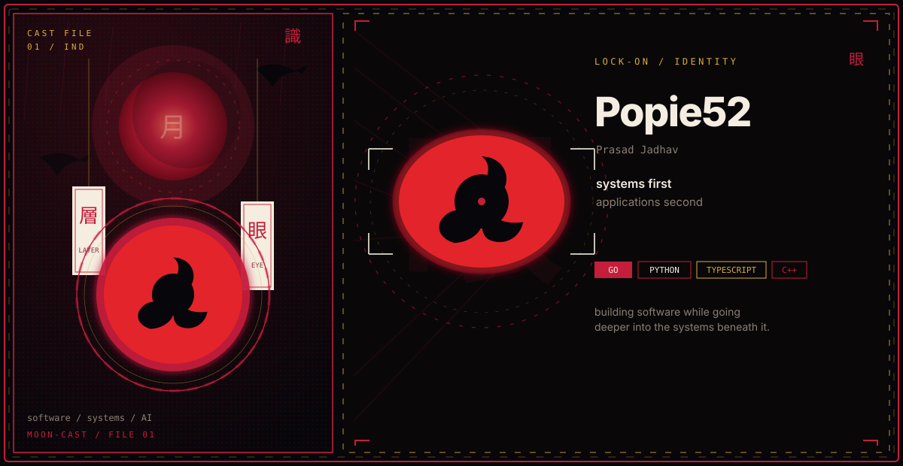

  

  systems first, applications second
  &nbsp;&middot;&nbsp;
  <a href="https://github.com/Popie52">github.com/Popie52</a>

  

**Lock-on**

1. **01** [PulseNet](https://github.com/Popie52/PulseNet) — Realtime messaging fabric (auth + message services)
2. **02** [DocuMind](https://github.com/Popie52/DocuMind) — Telegram RAG assistant: parse, embed, cite
3. **03** [job-queue-go](https://github.com/Popie52/job-queue-go) — Crash-safe priority queue; Postgres is source of truth
4. **04** [Sentinel](https://github.com/Popie52/sentinel) — TCP scanner built from POSIX sockets upward

**Side notes**

- [genie-cli](https://github.com/Popie52/genie-cli) — Local Gemini CLI that reads and runs project files
- [ai-agent-pipeline](https://github.com/Popie52/ai-agent-pipeline) — Five-agent Gemini pipeline with a trace UI

  <a href="https://github.com/Popie52">GitHub</a>
  &middot;
  <a href="https://github.com/Popie52?tab=repositories">Repositories</a>
  &middot;
  <a href="https://github.com/Popie52/Popie52">This profile</a>

