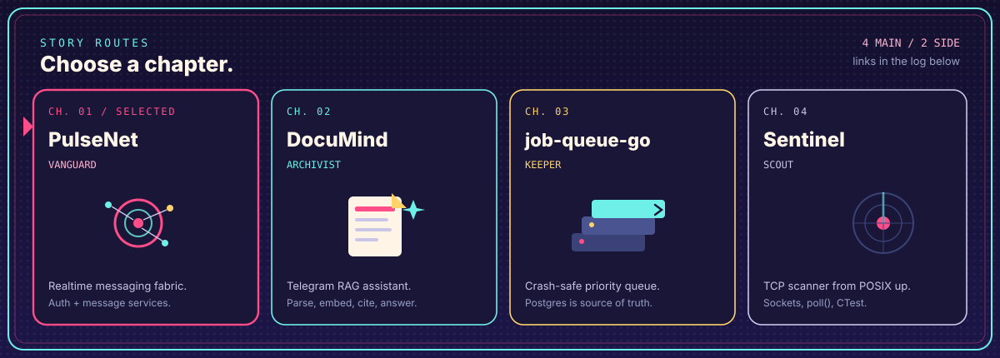
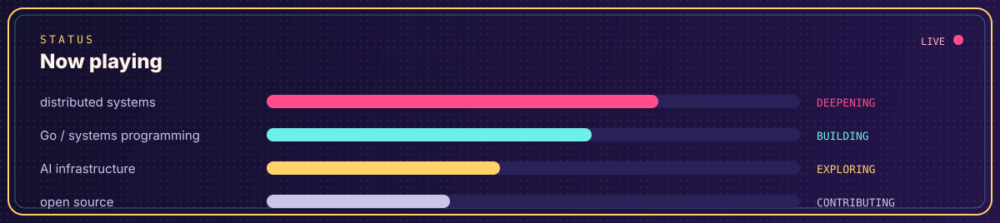
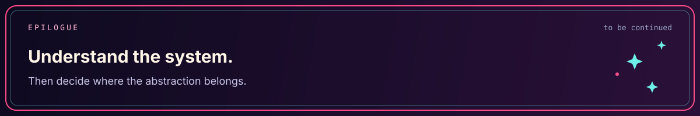

  

  systems first, applications second
  &nbsp;&middot;&nbsp;
  <a href="https://github.com/Popie52">github.com/Popie52</a>

  

| Ch | Route | What it is |
|:--:|:------|:-----------|
| **01** | [PulseNet](https://github.com/Popie52/PulseNet) | Realtime messaging fabric (auth + message services) |
| **02** | [DocuMind](https://github.com/Popie52/DocuMind) | Telegram RAG assistant: parse, embed, cite |
| **03** | [job-queue-go](https://github.com/Popie52/job-queue-go) | Crash-safe priority queue; Postgres is source of truth |
| **04** | [Sentinel](https://github.com/Popie52/sentinel) | TCP scanner built from POSIX sockets upward |
| S1 | [genie-cli](https://github.com/Popie52/genie-cli) | Local Gemini CLI that reads and runs project files |
| S2 | [ai-agent-pipeline](https://github.com/Popie52/ai-agent-pipeline) | Five-agent Gemini pipeline with a trace UI |

  

  

  <a href="https://github.com/Popie52">GitHub</a>
  &middot;
  <a href="https://github.com/Popie52?tab=repositories">Repositories</a>
  &middot;
  <a href="https://github.com/Popie52/Popie52">This profile</a>

